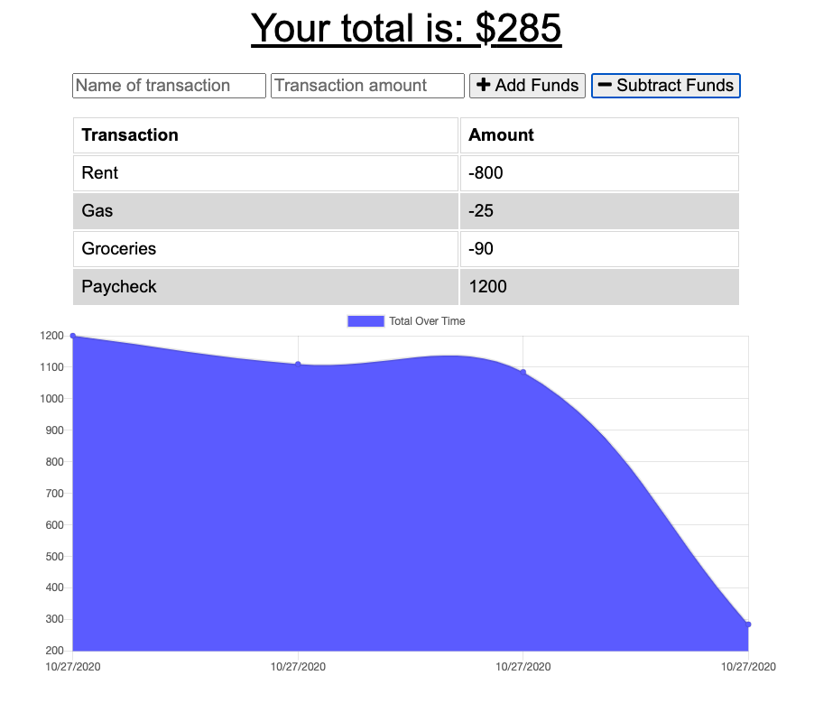

# Smart-Budget-PWA

## Table of Contents

- [Description](#description)
- [Screenshot](#screenshot)
- [Contributions](#contributions)
- [License](#license)

## Description

Simple budgeting PWA that allows users to enter deposits/expenses online or offline.

## Screenshot

## Contributions

Thanks in particular to Jonathan Watson for his guidance on this one.

## License

MIT License

Copyright (c) 2020 Andrew Stewart
